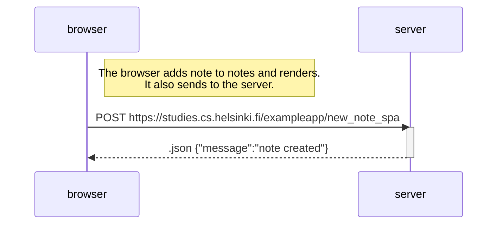

```mermaid
sequenceDiagram
    participant browser
    participant server

    Note right of browser: The browser adds note to notes and renders.<br>It also sends to the server.
    browser->>server: POST https://studies.cs.helsinki.fi/exampleapp/new_note_spa
    activate server
    server-->>browser: .json {"message":"note created"}
    deactivate server
```
    